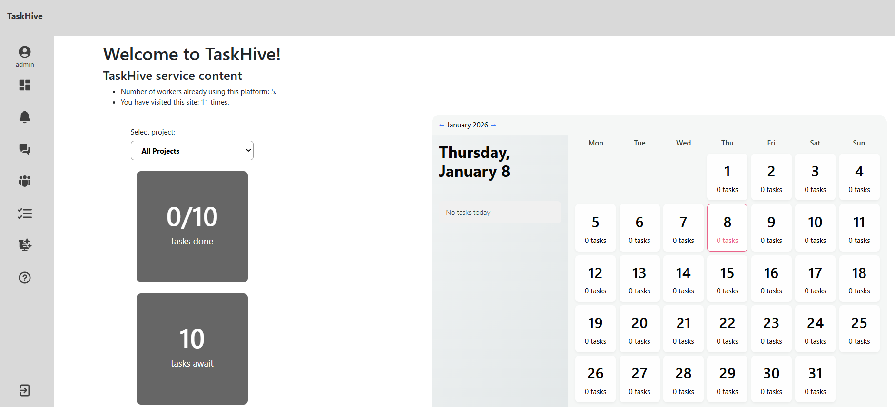
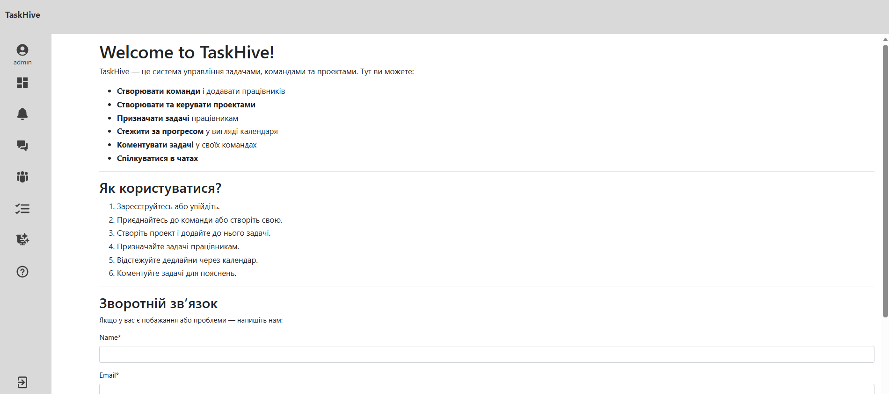
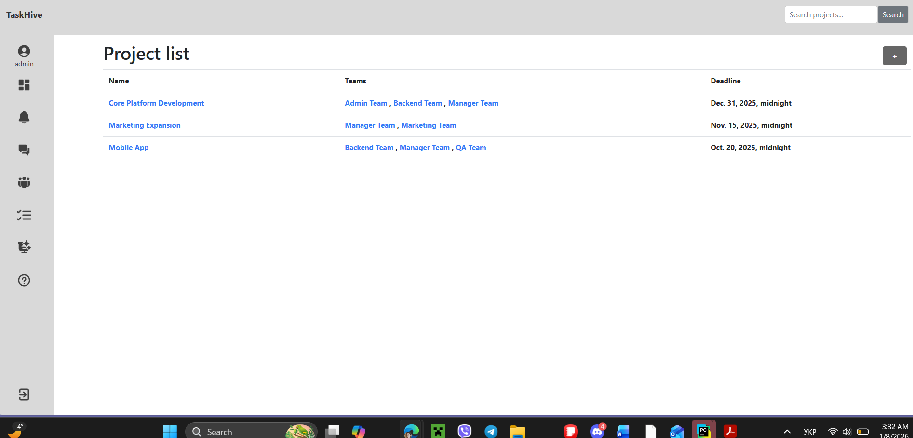
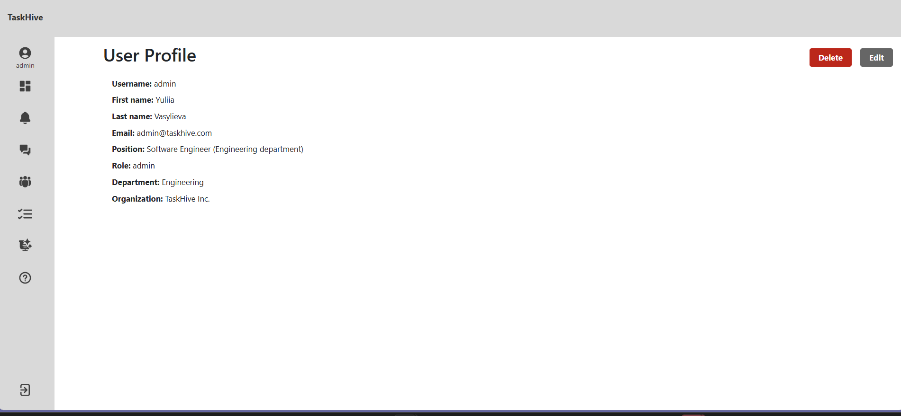

<!-- PROJECT LOGO -->
<p align="center">
  <h2 align="center">TaskHive</h2>
  <p align="center">
    A lightweight web-based task management system for IT teams.
  </p>
</p>

---

<!-- BADGES -->
<p align="center">
  
  
  
</p>

---

## 📌 About

TaskHive is a **lightweight web-based task management system** designed for IT teams — including developers, designers, project managers, and QA engineers — to **plan, assign, and track tasks efficiently**, improving collaboration and productivity within a project. :contentReference[oaicite:1]{index=1}

---
## 🚀 Live Demo
https://taskhive-q2ln.onrender.com

## 🛠 Deployment
The project is deployed using Render.

## 👤 Test Account
- Login: testuser
- Password: testpassword123

---

## 🖼️ Screenshots

### 🏠 Main Page


### 📋 Dashboard


### 🗂️ Project List


### ✅ Task List


### 👥 Teams


### 💬 Chats List


### 💬 Chat Interface


### 💬 Comments


### 👤 User Profile


---

## 📦 Features

- ✔️ Create, assign, update, and delete tasks  
- ✔️ Organize team tasks with clear priorities  
- ✔️ Track task progress and status  
- ✔️ Simple and intuitive UI

---

## 🛠️ Tech Stack

**Front-End:** Django templates, HTML, CSS, JavaScript  
**Back-End:** Django (Python)  
**Database:** SQLite (default)  


---

## ⚙️ Installation

Python must be already installed on your system.

```sh
# Clone the repository
git clone https://github.com/Qellexi/TaskHive.git
cd TaskHive

# Create virtual environment
python -m venv venv

# Activate virtual environment
source venv/bin/activate  # On Windows: venv\Scripts\activate

# Install dependencies
pip install -r requirements.txt

# Apply migrations
python manage.py migrate

# Run the development server
python manage.py runserver

